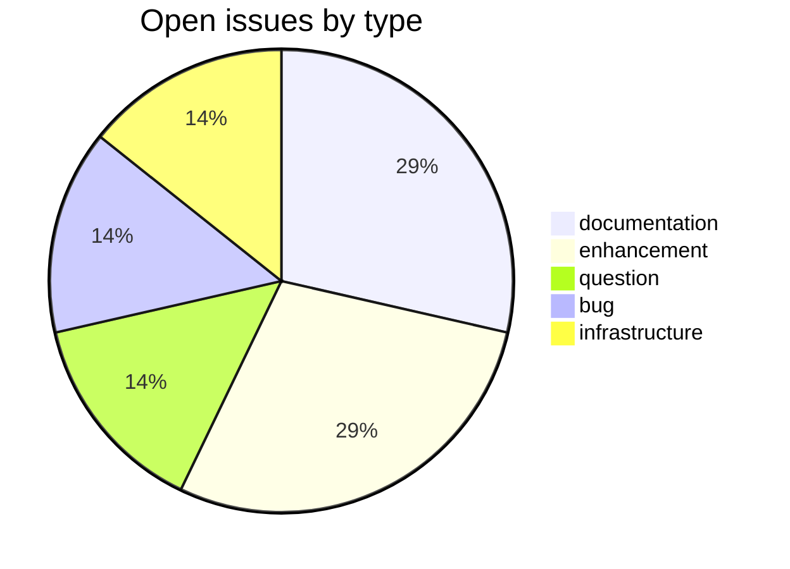
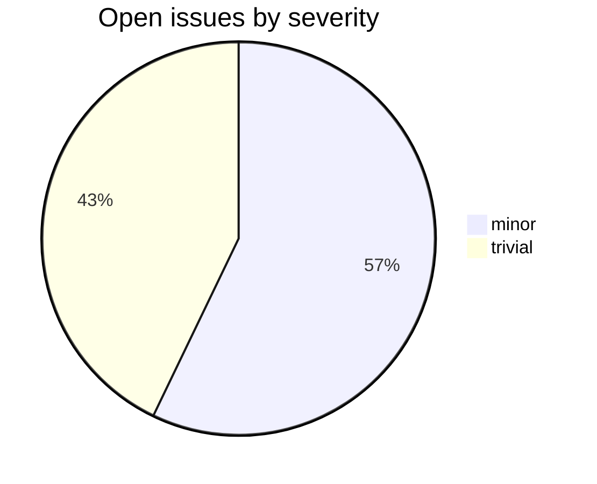

# csl-pywork

CDSL **data-store** repository in the Sanskrit Lexicon project.
A template for creating pywork repository for each dictionary.

<!-- BEGIN MANUAL: overview -->
`csl-pywork` contains the per-dictionary build scripts and templates used to
turn `csl-orig` source text into generated CDSL artifacts: headword lists, XML,
SQLite databases, downloads, and web-display support files.

## Input and output

| Direction | Location | Notes |
|---|---|---|
| Input source | `../csl-orig/v02/<dict>/` | Canonical dictionary text, metadata, and extra headwords. |
| Web templates | `../csl-websanlexicon/` | Used by `generate_web.sh` during `v02` generation. |
| Generated output | `../<dict>/` or server-specific scan directories | Contains `orig/`, `pywork/`, `web/`, and `downloads/`. |
| Documentation | `v02/readme.md` | Current production pipeline notes. |

## Directory map

| Path | Role |
|---|---|
| `v02/` | Current production generation pipeline. |
| `v00/` | Older generation pipeline and historical scripts. |
| `v02/makotemplates/` | Shared template files rendered or copied into dictionary builds. |
| `v02/distinctfiles/` | Per-dictionary files that override or extend shared templates. |
| `issues/` | Issue-specific experiments and fixes. |
| `tests/` | Regression checks where available. |

## Typical build flow

The current single-dictionary flow is documented in `v02/readme.md`:

```sh
cd csl-pywork/v02
sh generate_dict.sh mw ../../MWScan/2020
```

At a high level:

```text
csl-orig source -> generate_orig.sh -> generate_pywork.sh -> generate_web.sh -> generated pywork/web/downloads
```

The root `redo.sh` is an older broad regeneration script that pulls sibling
repositories and rebuilds selected dictionaries in a Cologne/XAMPP-style layout.

## Per-dictionary conventions

Most detailed notes live under `v02/distinctfiles/<dict>/pywork/` or a local
issue directory.  Read the nearest `readme.*` before changing a dictionary's
abbreviation, bibliography, tooltip, or SQLite generation scripts.

## Common failure modes

- Sibling repositories are expected in the same parent directory.
- Several scripts assume bash plus command-line `sqlite3`, `xmllint`, `zip`,
  PHP, and Python/Mako.
- Generated files can be stale; check the source commit and rerun the relevant
  `redo*` script before drawing conclusions.
- Windows/XAMPP and Cologne server paths differ; older notes may need path
  adjustment before rerun.
<!-- END MANUAL: overview -->

## Tech Stack

- **Runtime**: Python
- **Build**: per-repo workflow
- **Pipeline**: see [csl-observatory tooling runbook](https://github.com/sanskrit-lexicon/csl-observatory/blob/main/runbook/cologne-tooling-runbook.md)

## Issues Overview

Snapshot 2026-05-29: **7** open, **39** closed.

### By Milestone

| Milestone | Open | Closed | Total |
|---|---:|---:|---:|
| API Stability | 3 | 0 | 3 |
| User Experience | 1 | 0 | 1 |
| Data Quality | 0 | 0 | 0 |
| Developer Experience | 0 | 0 | 0 |
| Community | 0 | 0 | 0 |

### By Type



### By Severity



## GitHub Issue Conventions

Follows the [Cologne tooling-repo taxonomy](https://github.com/sanskrit-lexicon/csl-observatory/blob/main/runbook/cologne-tooling-runbook.md):

- **17 type labels** across 5 categories
- **4 severity levels**: trivial, minor, major, critical
- **5 milestones**: API Stability, User Experience, Data Quality, Developer Experience, Community
- **Domain labels** scoped to data-store: `domain:schema`, `domain:migration`, `domain:integrity`, `domain:storage`
- **Org Project**: [Tooling Roadmap](https://github.com/orgs/sanskrit-lexicon/projects/9)

---
*Generated by Cologne Tooling Runbook on 2026-05-29*
